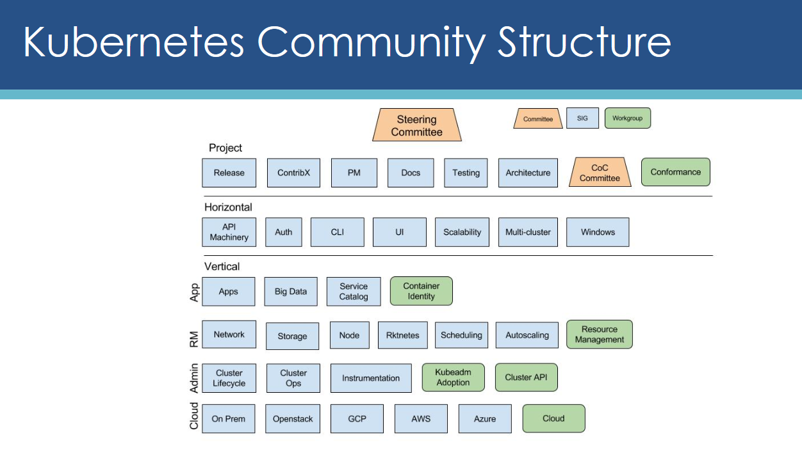

# Kubernetes goals and usage advantages

### [Back](../README.md)

| Kubernetes project goal                                                                                                                                                                                                                   |
| ----------------------------------------------------------------------------------------------------------------------------------------------------------------------------------------------------------------------------------------- |
| The Kubernetes project community and contributing companies aim to create universal container orchestration and management system that suits for applications of any scale and facilitates both declarative configuration and automation. |

| Kubernetes project structure map                                                                                                                   |
| -------------------------------------------------------------------------------------------------------------------------------------------------- |
|                                                                                      |

[Kubernetes Community Overview and Contributions Guide ](https://docs.google.com/presentation/d/1JqcALpsg07eH665ZXQrIvOcin6SzzsIUjMRRVivrZMg/edit)

|Title|Link|
|-|-|
|Getting Kubernetes Builds| https://github.com/kubernetes/community/blob/master/contributors/devel/sig-release/getting-builds.md |
|Kubernetes Issue Triage Guidelines|https://github.com/kubernetes/community/blob/master/contributors/guide/issue-triage.md |
|Development Guide|https://github.com/kubernetes/community/blob/master/contributors/devel/development.md|
|End-to-End Testing in Kubernetes|https://github.com/kubernetes/community/blob/master/contributors/devel/sig-testing/e2e-tests.md|
|Testing guide|https://github.com/kubernetes/community/blob/master/contributors/devel/sig-testing/testing.md|
|Conformance Testing in Kubernetes|https://github.com/kubernetes/community/blob/master/contributors/devel/sig-architecture/conformance-tests.md|
|Flaky tests|https://github.com/kubernetes/community/blob/master/contributors/devel/sig-testing/flaky-tests.md|
|Profiling Kubernetes|https://github.com/kubernetes/community/blob/master/contributors/devel/sig-scalability/profiling.md|
|Instrumenting Kubernetes|https://github.com/kubernetes/community/blob/master/contributors/devel/sig-instrumentation/instrumentation.md|
|Getting started k8s development locally |https://github.com/kubernetes/community/blob/master/contributors/devel/running-locally.md|

### Kubernetes project helpful links:

| Title                                                                                                                     | Description          |
| ------------------------------------------------------------------------------------------------------------------------- | -------------------- |
| [Kubernetes Development Automation](https://github.com/kubernetes/community/blob/master/contributors/devel/automation.md) | https://prow.k8s.io/ |
|                                                                                                                           |                      |

| Why do I need Kubernetes?                                                                                                                                                                            |
| ---------------------------------------------------------------------------------------------------------------------------------------------------------------------------------------------------- |
| <b style="color:#33aaff"><i>Manage applications, not machines</i></b>                                                                                                                                |
| `Kubernetes creates abstraction layer between network, storage, security and computational infrastructure to concentrate on fast application development, deployment and delivery`                   |
| <b style="color:#33aaff"><i>Portable and universal container management environment</i></b>                                                                                                          |
| `Literally, it’s next generation distributed OS for Cloud world`                                                                                                                                     |
| <b style="color:#33aaff"><i>Easy to create and deliver microservice-based applications</i></b>                                                                                                       |
| `Kubernetes has all necessary resource abstractions and extensibility points to fit with well-done microservice architecture from day-one.`                                                          |
| <b style="color:#33aaff"><i>The simplicity of Platform as a Service (PaaS) with the flexibility of Infrastructure as a Service (IaaS)</i></b>                                                        |
| `All external cluster administration is managed from kubectl tool under secure tunnel with resources that have good separation of concerns between interface definition and control implementation.` |
| <b style="color:#33aaff"><i>Flexible workflow abstractions</i></b>                                                                                                                                   |
| `Kubernetes doesn’t dictate what you should use for your application infrastructure, but helps with proper choice and integration.`                                                                  |
