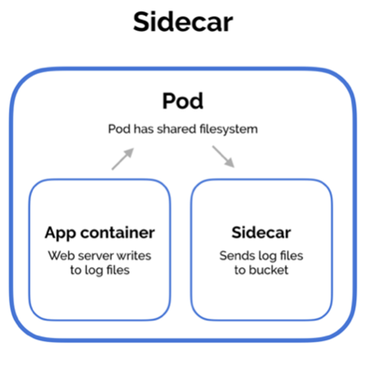
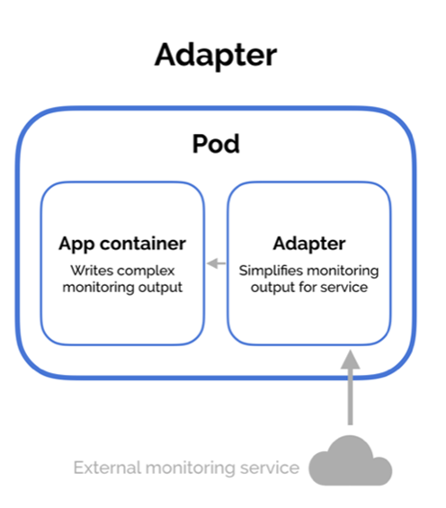
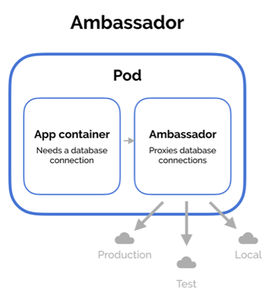
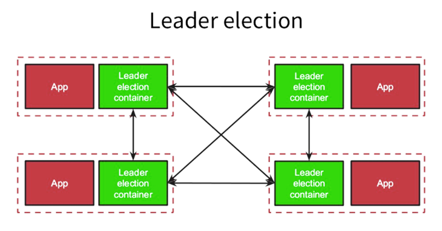
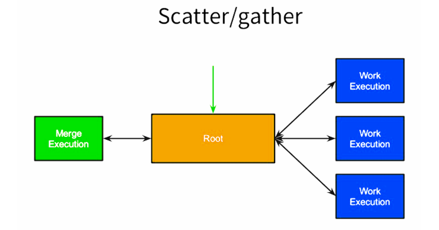
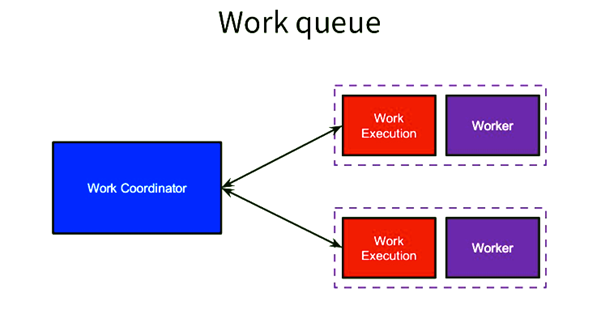

# Common container patterns

### [Back](../README.md)

| Pattern diagram | Description |
| ----------------| ------------ |
|  | Sidecar pattern extends and enhance the main container. |
|  | Adapter present the outside world with a simplified, homogenized view of an application. |
|  | Ambassador containers proxy communication to and from a main container. |
|  | A set of leader-election containers, each one co-scheduled with an instance of the application that requires leader election, can perform election amongst themselves, and they can present a simplified HTTP API over localhost to each application container that requires leader election
 |
|  | This root fans the request out to a large number of servers to perform computations in parallel. Each shard / server returns partial data, and the root gathers this data into a single response to the original request.
 |
|  | The work queue pattern dictates that you split up a big task into smaller tasks to reduce running time. The code that does the processing work can be packed into a worker container, and then you can spin up several pods at the same time.
 |