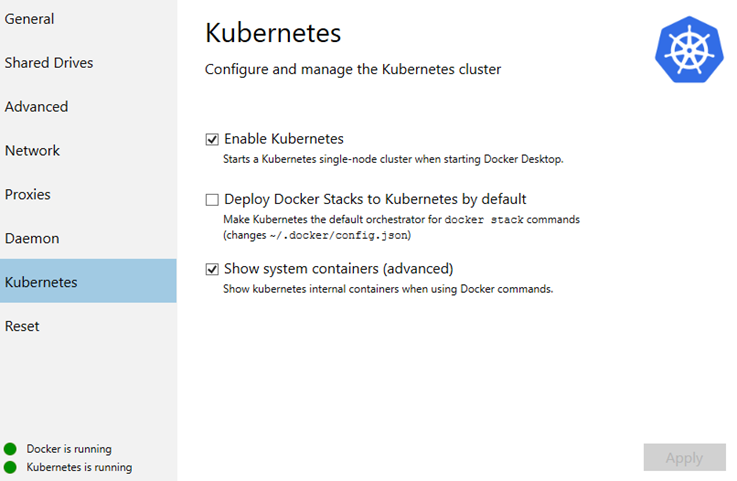
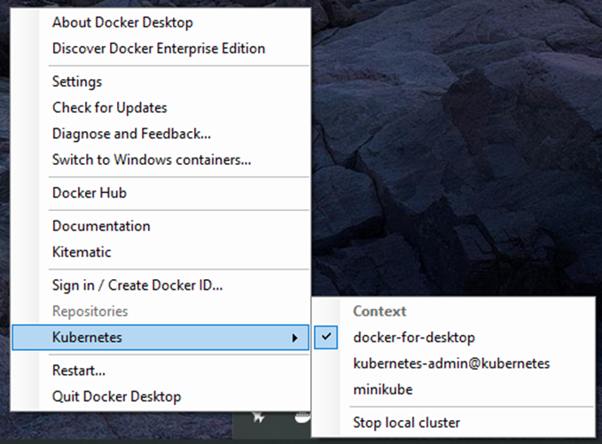
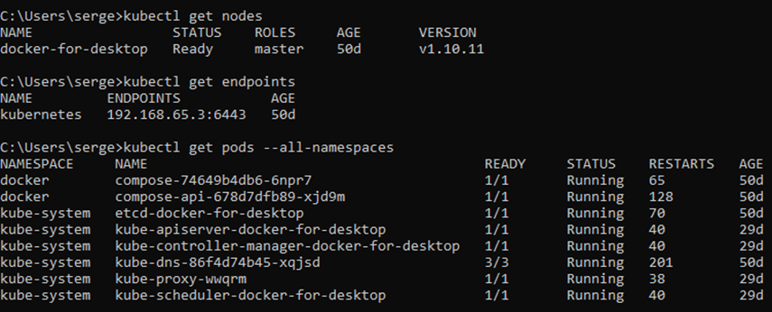

# `One-click` start with Kubernetes dashboard as starting learning point

### [Back](../README.md)

#### <p style="color:#a0a0a0">If you have experience with Docker before and use it in local environment for experiments or on everyday basis then you already have ability to bootstrap your own <span style="color:#ff5050">Kubernetes single-node cluster with one click. </span>Just go to `Docker Settings` and select Kubernetes menu. Than click on `Enable Kubernetes`. Maybe you want to manage `docker-compose.yml` files then also check `Deploy Docker Stacks to Kubernetes by default`. This feature will create compose-controller in Kubernetes. Wait for green status and you’re ready to go.</p>

|  |  |
| --------------------------------------------- | ------------------------------------------------------------------ |

- You can start your work with Kubernetes though `kubectl` cli utility immediately after Docker engine complete kubernetes cluster components setup.

#### Check that `docker-for-windows` context has selected and get some info about cluster state. Just launch several Kubernetes resource state observing commands to check `kubectl` accessability:



#### Then execute (It's Windows installation process. Please, refer the official helm docs for other OS):
- ```choco install kubernetes-helm``` <- After helm installation process you're be able to deploy public charts from stable repo(or any 3rd party repos if they will be registered in the system)
- ```helm init``` <- wait while Tiller pods will be ready in Kubernetes cluster

#### When `helm` has been installed you can continue with Kubernetes Dashboard deployment:
- ```kubectl create -f https://raw.githubusercontent.com/kubernetes/dashboard/v1.10.1/src/deploy/alternative/kubernetes-dashboard.yaml``` <- yaml file contains dashboard deployment resource configuration without required authentication with TLS certs (`alternative` deployment mode).
- ```helm install --name dashboard --namespace kube-system stable/heapster``` <- This chart contains `legacy` Kubernetes cluster compute resource monitoring service, but this service is used by dashboard for graphical cpu/memory allocation visualization.
- ```kubectl proxy``` <- create local secure proxy tunnel that targets Kubernetes cluster

#### It's done. Enter http://localhost:8001/api/v1/namespaces/kube-system/services/http:kubernetes-dashboard:80/proxy/#!/overview?namespace=_all in browser and see you cluster state in user-friendly manner, out of CLI representation.