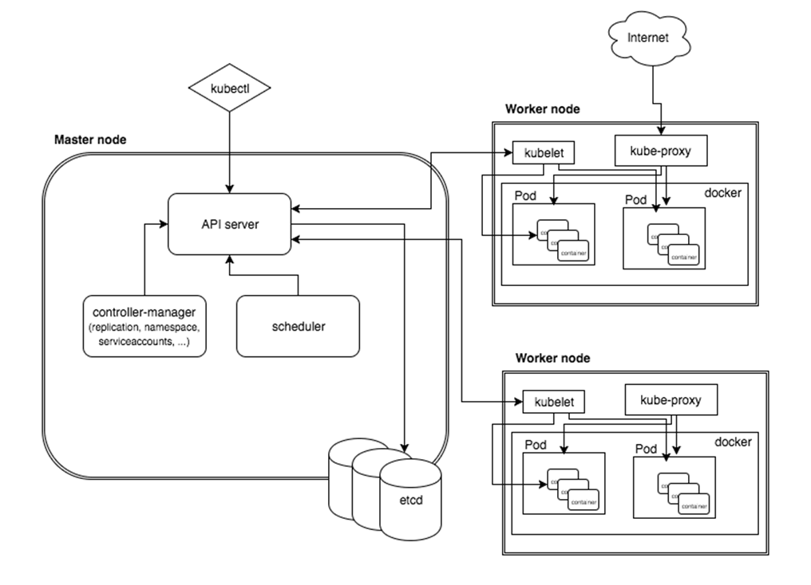

# Control plane definition

### [Back](../README.md)

### Kubernetes Cluster decomposion diagram

| Node role                                                                                                   |
| ----------------------------------------------------------------------------------------------------------- |
| <b>Master node</b> hosts the Kubernetes Control Plane that controls and manages the whole Kubernetes system |
| <b>Worker nodes</b> run the actual applications from Kubernetes resources                                   |

| Component                 | Description                                                                                                                                           |
| ------------------------- | ----------------------------------------------------------------------------------------------------------------------------------------------------- |
| <i>API Server</i>         | Control Plane components and external tools communicate with API Server                                                                               |
|                           |
| <i>Scheduler</i>          | Scheduler schedules your apps (assigns a worker node to each deployable component of an application)                                                  |
|                           |
| <i>Etcd</i>               | Etcd is a reliable distributed data store that persistently stores the cluster configuration                                                          |
|                           |
| <i>Controller Manager</i> | Controller Manager performs cluster-level functions, such as replicating components, keeping track of worker nodes, handling node failures, and so on |
|                           |
| <i>Kubelet</i>            | Kubelet talks to the API server and manages containers on its node                                                                                    |
|                           |
| <i>kube-proxy</i>         | kube-proxy which load-balances network traffic between application components                                                                         |
|                           |
| <i>CRI</i>                | CRI (container runtime, Docker for ex.) runs your containers                                                                                          |
|                           |