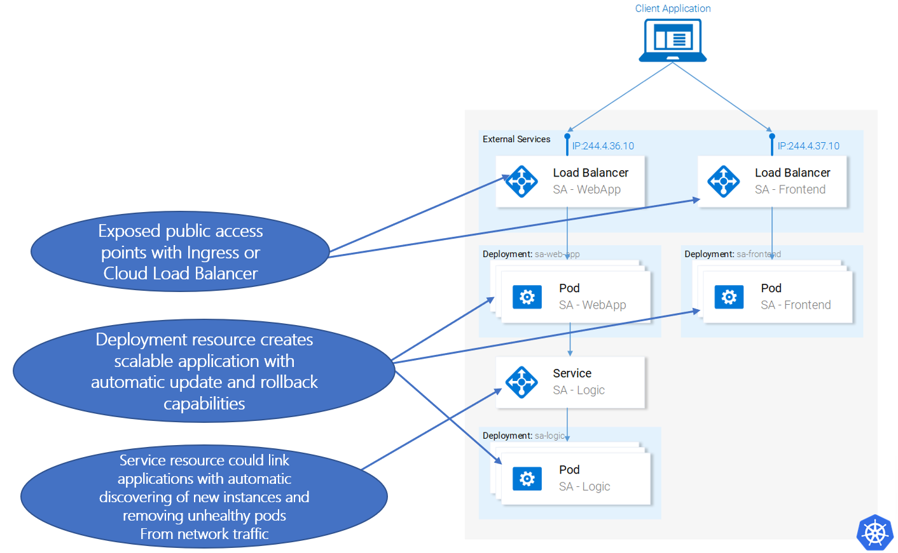

# Simplified Kubernetes Application structure map

### [Back](../README.md)

| Kubernetes component                   | Role                                                                                                           |
| -------------------------------------- | -------------------------------------------------------------------------------------------------------------- |
| <i>Pod</i>                             | Real container with executing application process                                                              |
| <i>Deployment</i>                      | Manage concrete application lifecycle into Kubernetes cluster                                                  |
| <i>Service</i>                         | Links application pods created by deployment in centralized stable network entrypoint for specific application |
| <i>LoadBalancer Service or Ingress</i> | Creates external public entrypoint outside of cluster network                                                  |
| <i>HPA</i>                             | Managing dynamic creation and disposal of specific replication pod set by custom balancing rules               |