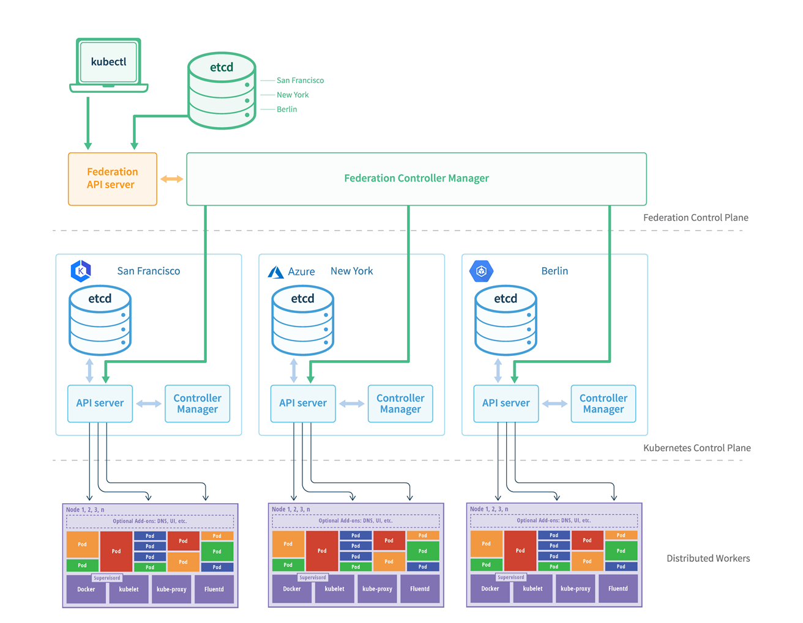

# Kubernetes architecture high level overview

### [Back](../README.md)

## Architecture of abstract multi-tenant and cloud provider agnostic HA Kubernetes cluster

### Like most distributed computing platforms, a Kubernetes cluster consists of at least one master and multiple compute nodes. Also in pursuit of high availability and performance, modern deployments are regularly scaled out beyond the confines of a single datacenter or cloud region.